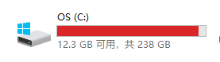

# 搭建开发环境

## Anaconda简介

官网是[https://www.anaconda.com/](https://www.anaconda.com/)，你可以把它理解为`Python项目依赖`管理器。

我们开发Python项目时，免不了用一些第三方包，如：flask、skit-learn、pytorch等等。当然，不止是Python，如果你熟悉Java或JavaScript的话，这些语言开发的项目也会有第三方包的依赖。

如果我们有多个Python项目，而这些项目又依赖了同一个包的不同版本，比如：A项目基于pytorch1.1开发，而B项目则需要pytorch1.3才能正常运行。甚至，这些项目的Python版本都不同，A项目使用的是Python3.8版本，而B项目则基于Python3.11版本来开发，这个时候，如果要同时开发A和B项目，你会怎么办？

面对上面这种情况，使用Anaconda后，就会非常方便，Anaconda中有`虚拟环境`的概念，每一个虚拟环境可以看做是`Python项目的运行环境`，继续上面这种开发情况来说，我们可以使用Anaconda创建两个名EnvA和EnvB的虚拟环境，对各项目的Python版本、依赖分别进行管理，以免出现运行失败的情况。

Anaconda的Window、Mac安装很简单，只需下载对应的安装包，一路下一步就可以。对于Window，中间注意一下安装位置，尽量别安装到C盘，导致C盘报红，倒不是说Anaconda占用的空间大，只是说尽量避免这种能引起C盘报红的情况。



对于Linux，这里简单记录一下安装步骤。

## Debain上安装Anaconda

从官网地址中的这个地址：[https://www.anaconda.com/products/distribution#Downloads](https://www.anaconda.com/products/distribution#Downloads)
，选择最右侧Linux的第一个链接，鼠标右击，复制下载链接，类似下面这样：

https://repo.anaconda.com/archive/Anaconda3-2022.10-Linux-x86_64.sh

### 1 下载sh脚本
在Debian服务器上，使用wget工具，下载安装脚本：
```shell
wget https://repo.anaconda.com/archive/Anaconda3-2022.10-Linux-x86_64.sh
```
### 2 执行脚本
Debian服务器上执行脚本文件，当然，保险起见，你可以验证一下脚本文件的MD5值，这里，我就直接安装了。
```shell
# 给脚本添加执行权限
chmod +x Anaconda3-2022.10-Linux-x86_64.sh
# 运行脚本
./Anaconda3-2022.10-Linux-x86_64.sh
```
开始安装，过程中，可以都选择默认，一路回车即可。

需要注意的是，最后一步，会问你是否默认激活Anaconda环境，选择yes的话，后续在登录上终端后，都会默认激活base虚拟环境。选择no的话，每次需要手动激活Anaconda环境。

### 3 激活anaconda环境
如果不想每次登录终端都默认激活Anaconda，则使用以下命令进行手动激活。
```shell
source ~/.bashrc
```

### 4 命令初体验
初步体验一下Anaconda，可以使用`conda list`查看安装包列表
```shell
conda list
```


至此，Anaconda安装完成。

## Anaconda常用命令

### 查看已安装的包

用以下命令查看当前虚拟环境中有哪些依赖包，包含当前的Python包

```shell
conda list
```

### 操作虚拟环境

虚拟环境是Anaconda的基础，我们可以使用以下命令来进行操作

```shell
# 查看全部虚拟环境
conda env list 

# 创建虚拟环境 
# 注意：这两个只能2选1，不能 -n 和 -p 参数同时用
# 通过名称（-n参数）创建虚拟环境
conda create -n pytorch python=3.11
# 通过路径（-p参数）创建虚拟环境
conda create -p /opt/pkg/env python=2.9 

# 激活虚拟环境
conda activate pytorch 
# 退出虚拟环境
conda deactivate 

# 通过路径删除虚拟环境，XXX指虚拟环境路径
conda env remove -p XXX 
```


## 修改记录
|版次|时间|修改|
|---|---|---|
|v1|已忘记|初步记录|
|v2|2023.04.05|补充部分内容，将Debian安装步骤和常用命令合到一处|