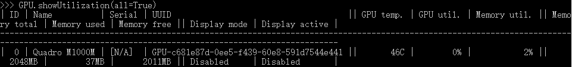
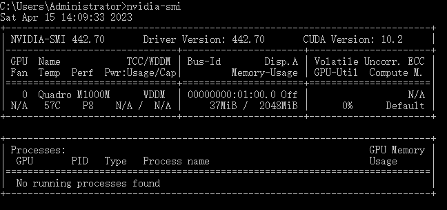
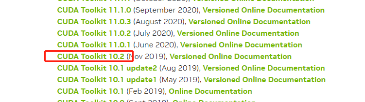
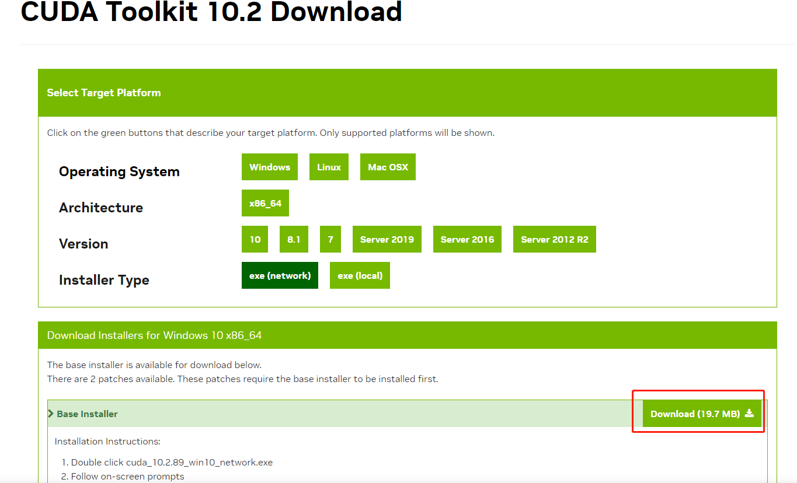
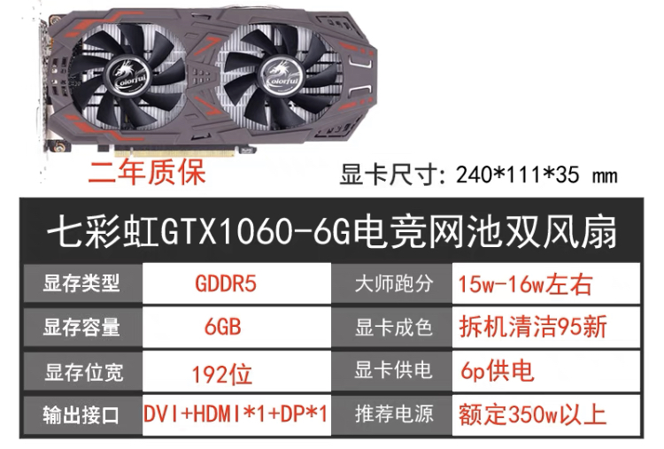
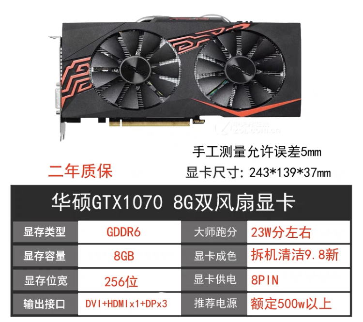

# 了解一下GPU

GPU是一个协处理器，必须和CPU一起来进行工作，但它与CPU端的存储却是分离的，各存储各的。当GPU运算时，必须得先等CPU端的代码和数据，当CPU将代码和数据传输到GPU后，GPU才能执行Kernel函数。

GPU与CPU通信，是通过主板来完成的，GPU和主板的通信接口，目前主流的是PCIe（PCI-Express）4.0版本，提供数据流量的带宽，为16个通道。这个通信接口的版本和性能会直接影响通信带宽。

## 1 查看已安装的GPU信息

我们可以使用Python的`GPUtil`包，地址：[https://github.com/anderskm/gputil](https://github.com/anderskm/gputil)，来查看已经安装好的GPU信息。

### 1 安装
使用 pip 命令进行安装

```python
pip install GPUtil
```

### 2 命令

查看电脑GPU情况

```python
import GPUtil as GPU

GPU.showUtilization(all=True)
```



图中能够看出这么几种信息

|名称|显示内容|解释|
|---|---|---|
|Name|Quadro M1000M| 显卡名称|
|UUID|GPU-c681e87d-0ee5-f439-60e8-591d7544e441|显卡的唯一ID|
|Memory total|2048MB|显存为2G|
|Memory used|37MB|已使用的显存|
|Memory free|2011MB|剩余显存|

详细命令使用参考[https://github.com/anderskm/gputil/blob/master/GPUtil/demo_GPUtil.py](https://github.com/anderskm/gputil/blob/master/GPUtil/demo_GPUtil.py)

## 2 通过系统查看GPU信息

在Win10系统下，可以使用以下命令来查看GPU信息

```shell
nvidia-smi
```

命令会输出以下信息



```text
提示找不到命令
nvidia-smi.exe可执行文件，一般在Win10的 `C:\Program Files\NVIDIA Corporation\NVSMI`目录下，将该目录加入到Path环境变量中即可
``` 

图中的`CUDA Version`这个属性很重要，我这里是`10.2`。

如果想要在`paddle`、`pytorch`这种深度学习框架里使用GPU，需要根据`CUDA Version`安装对应的驱动工具。

### 1 安装CUDA工具包

从nvidia的这个网址[https://developer.nvidia.com/cuda-toolkit-archive](https://developer.nvidia.com/cuda-toolkit-archive)里下载驱动，进行安装。

从图中能看出，我这里的CUDA版本是10.2，所以下 对应 10.2的版本。



选中对应的版本，点击进入到下载详情页中，选中对应的系统版本，进行下载。我是Win10系统，选择的在线安装。



下载完成后，在安装的时候，有一个界面是选择精简还是**自定义**，选择自定义，然后一路下一步，等待安装完成就行。

### 2 安装cuDNN包

继续从nvdia的网址[https://developer.nvidia.com/rdp/cudnn-download](https://developer.nvidia.com/rdp/cudnn-download)下载cudnn包。

这个包的下载需要登录，注册过程很容易，需要一个邮箱，然后，按表单内容进行填写，填写好后，进行注册即可。

注册完成后，就可以下载cuDNN包。

将下载到的cuDNN压缩包，解压到上一步`CUDA安装包`的安装目录中，并修改名为 cudnn，Win10系统下，路径为

`C:\Program Files\NVIDIA GPU Computing Toolkit\CUDA\v10.2\cudnn`

到此，CUDA工具包、cuDNN包就都完成安装了。

### 3 测试GPU能否正常调用

两个包安装完成后，我们在目录`C:\Program Files\NVIDIA GPU Computing Toolkit\CUDA\v10.2\extras\demo_suite`下打开终端，输入以下命令进行测试

```shell
.\bandwidthTest.exe
.\deviceQuery.exe
```

两个命令的输出结果中，最后一行，都显示通过即可。

```text
Result = PASS
```

## 3 GPU关键参数

从商店里选显卡时，通常会看到这些信息：




其中的GTX1060-6G、GTX1070 8G、显存类型、显存容量、显存位宽，这些参数都表示啥含义？

### 1 GPU的代号

上面参数中的GTX1060、GTX1070，表示GPU的代号，这种代号是GPU的Core的一种表示，每种Core都有自己的代号。

GPU中的Core，也就是我们常说的**核**，它包含两种，`CUDA Core`和`Tensor Core`，是GPU完成计算的硬件单元。

CUDA Core也叫Streaming Processor（SP），是单精度的，是组成SM的重要部分。

Tensor Core是用于计算的，已发展到第三代，数量越多，并行运算的线程越大，计算的峰值越高。它通常能大幅减少了深度学习需要的时间。

### 2 显存容量

GPU有自己的存储空间，它的容量大小，就是我们通常说的**显存容量**，比如前面的`8G、6G`。这个存储空间主要用来储存GPU要处理的数据，以及处理完毕的数据。

显存容量的大小，决定了GPU能够加载的数据量，大显存能减少读取数据的次数，降低延迟，在深度学习、机器学习的训练场景，显存的大小决定了一次能够加载训练数据的量，在大规模训练时，或者，模型比较大时，所需要的显存就越多，此时显存就显得比较重要。

> 显存类型从原来的容量不大的SDR，发展到DDR、SDRAM、DDR3、DDR4等。从Pascal架构开始，NVIDIA已经开始提供HBM2类型的显存，最新针对专业计算的Tesla A100采用HBM2，显存容量可达40GB，为游戏设计的RTX 8080 Ti采用DDR6，显存容量也可达12GB。显存主要由传统的内存制造商提供，比如三星、现代、Kingston等。

如上面的显存类型，GDDR5、GDDR6。

### 3 显存位宽

在Core和显存之间传递数据时，我们把**一个时钟周期内所能传送数据的位数(bit)** 叫做 **显存位宽**，位数越大，表明瞬间传输的数据量就越大，它是显存的重要参数之一。

目前市场上的显存位宽，主要有64位、128位、256位和512位这几种，大家习惯上把他们称呼为，64位显卡、128位显卡和256位显卡，这里的位指的就是显存位宽。显存位宽越高，性能越好，当然价格也就越高，因此512位宽的显卡也就更贵，通常都是高端显卡，而主流显卡，基本都是128位和256位。

### 4 显存带宽

Core和显存之间会传输数据，而数据的传输速率，就叫带宽，单位是字节/秒，即，每秒传输多少字节。它是决定显卡性能和速度的最重要因素之一。

计算公式为:

> 显存带宽＝显存频率×显存位宽/8

比如：上面这款GTX1060 显卡，它的显存频率为8008MHz，显示位宽为192位，那么带宽计算可得

> 显存带宽=8008X192/8 = 192200 MB/s

转换为GB，则为

> 显存带宽=8008X192/8/1000(GB/s)=192.2 GB/s

### 5 吞吐量

吞吐量指的是GPU的**计算能力**，吞吐量越大，计算能力越强，单位为GFLOP/s（Giga-FLoating-point OPerations per second），表示每秒的浮点运算量，也是衡量GPU硬件计算能力的指标。

### 6 功率

GPU工作时，单位时间的耗电量，就是功率，比如RTX 3080 Ti功率为750W。

集成显卡，通常依靠CPU的主板连接来供电，而独立显卡，因为其性能较强，则需要单独接电源来供电。

## 修改记录
|版次|时间|修改|
|---|---|---|
|v1|2023.04.05|记录GPUtil的初步使用|
|v2|2023.04.09|整理GPU相关参数说明|
|v3|2023.04.16|补充Win10系统中查看GPU情况，并记录安装CUDA包和cuDNN包|