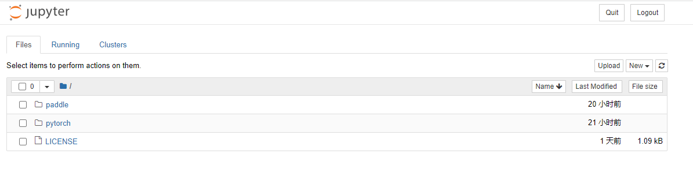

# 安装jupyterlab

jupyter的官网是[https://jupyter.org/](https://jupyter.org/)，一款能在浏览器里，执行Python代码的编辑器。当然，它功能远不止这两个，但这两点无疑是最吸引人的。

启动运行后，在浏览器中进行访问，页面如下



可以通过右上角的`New`按钮，创建Python脚本文件，或者文件夹等。

## 1 通过conda安装

在conda的一个虚拟环境中，执行以下命令进行安装

```shell
conda install jupyter notebook
```

安装完成后，通过以下命令来启动

```shell
# 使用默认 8888 端口启动
jupyter notebook
# 使用 指定端口 启动
jupyter notebook --port <port>
```

Win10下启动后，第一次会弹出一个**文件打开选择器**，这时一定要选择一个浏览器，最好是选择你常用的浏览器。选择好后，就会在浏览器中自动打开jupyter的访问链接，到此，jupyter就安装完成了。

如果我们要停止jupyter的运行，有两种方式：

1. 点击jupyter最顶部的右上角的`Quit`按钮进行退出
2. 在终端界面，使用`Ctrl + C`组合键来停止运行


## 2 修改默认的项目目录

jupyter默认使用的工作目录可能并不是我们想要的，我们期望每次运行jupyter时，直接打开我们的项目目录，这种情况下，我们可以按如下来进行配置。

先通过以下命令，生成jupyter的配置文件：

```shell
jupyter notebook --generate-config
```

命令运行后，Win10系统下，会输出以下内容：

```text
Writing default config to: C:\Users\Administrator\.jupyter\jupyter_notebook_config.py
```

也就是说，Win10系统下，配置文件生成在`C:\Users\Administrator\.jupyter\jupyter_notebook_config.py`目录里。

然后，我们编辑这个配置文件，修改默认打开的工作目录。

因为这个文件的内容有点多，我们可以使用查找功能，文件中查找`c.NotebookApp.notebook_dir`，找到后，修改它的值。

我这里，想要jupyter默认打开`D:\nlp_learn\`目录，因此，这里配置为 `D:\\nlp_learn\\`。

```text
注意双反斜杠
Win10系统下，需要注意的是，一定要用双反斜杠，否则jupyter启动时，会报错。
``` 

配置好后，重新启动jupyter，它会自动打开上面配置的这个目录。

## 修改记录
|版次|时间|修改|
|---|---|---|
|v1|2023.04.16|记录jupyter的安装和配置|