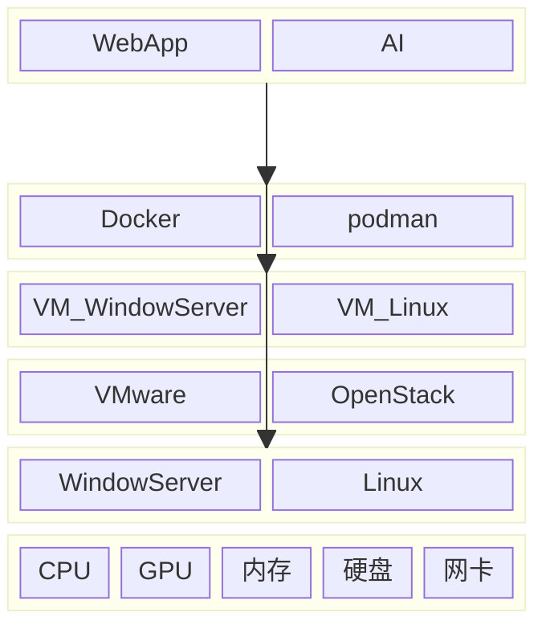
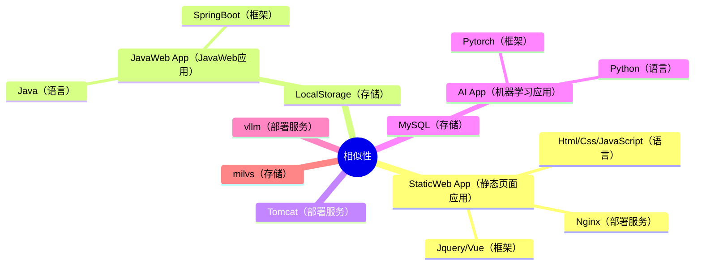

AI应用也是**应用**，和静态Web应用一样，只是相对后者来说，AI应用的能力更强，解决的问题页更复杂，当然，开发起来也更费力

无论是复杂的AI应用，还是简单的静态Web应用，最终都需要部署到服务器上才能提供服务，而服务器的种类无非就这么几种：
1. 原生宿主机：模式为 应用 => 操作系统 => 硬件
2. 虚拟机：模式为 应用 => 虚拟操作系统 => 原生操作系统 => 硬件
3. Docker容器：模式为 应用 => Docker => [虚拟操作系统=>] 原生操作系统 => 硬件

企业、公司的机房，云服务提供商，大多都是**虚拟机模式**，只是他们使用的**虚拟机软件**不同，比如：VMware、 [OpenStack](https://opendev.org/openstack)等

## 0x01.开发应用
### 0x01.pytorch
官网：[https://pytorch.org/](https://pytorch.org/)
文档：[https://docs.pytorch.org/docs/stable/index.html](https://docs.pytorch.org/docs/stable/index.html)

国外的基于Python开发的深度学习框架，由PyTorch Foundation进行维护

### 0x02.torchx
官网：[https://docs.pytorch.org/torchx/main/quickstart.html](https://docs.pytorch.org/torchx/main/quickstart.html)
文档：[https://docs.pytorch.org/torchx/main/quickstart.html](https://docs.pytorch.org/torchx/main/quickstart.html)

简化pytorch应用的训练、部署的一个Python工具，可以将pytorch应用发布到本地、Docker、云服务上运行

### 0x03.paddlepaddle
官网：[https://www.paddlepaddle.org.cn/](https://www.paddlepaddle.org.cn/)
文档：[https://www.paddlepaddle.org.cn/documentation/docs/zh/guides/index_cn.html](https://www.paddlepaddle.org.cn/documentation/docs/zh/guides/index_cn.html)

国内基于Python开发的深度学习框架，由百度团队进行维护

### 0x04.paddlex
官网：[https://paddlepaddle.github.io/PaddleX/latest/](https://paddlepaddle.github.io/PaddleX/latest/)
文档：[https://paddlepaddle.github.io/PaddleX/latest/](https://paddlepaddle.github.io/PaddleX/latest/)

简化Paddle应用训练、部署的一个Python工具，提供了多种Paddle模型，可以直接提供部署、服务

## 0x02.部署应用
### 0x01.ollama
官网：[https://ollama.com/](https://ollama.com/)
文档：[https://github.com/ollama/ollama/blob/main/README.md#quickstart](https://github.com/ollama/ollama/blob/main/README.md#quickstart)

>Get up and running with large language models.

运行LLM模型的一个Server（服务）

项目由国外个人成员维护，截止这篇文章前，共有3个维护人员，参见Github的`Person`页签

### 0x02.vllm
官网：[https://docs.vllm.ai/en/stable/index.html](https://docs.vllm.ai/en/stable/index.html)
文档：[https://docs.vllm.ai/en/stable/index.html](https://docs.vllm.ai/en/stable/index.html)

> vLLM is a fast and easy-to-use library for LLM inference and serving.

是一个为LLM模型提供inference（推理）和Server（服务）的Python库

由美国的UC Berkeley（加利福尼亚大学伯克利分校）的 Sky Computing Lab 发起并维护

### 0x03.dify
官网：[https://dify.ai/](https://dify.ai/)
文档：[https://docs.dify.ai/en/introduction](https://docs.dify.ai/en/introduction)

> Dify is an open-source platform for building AI applications. We combine Backend-as-a-Service and LLMOps to streamline the development of generative AI solutions, making it accessible to both developers and non-technical innovators.

是一个AI Agentic（AI智能体）的开发平台，将AI的后端服务和LLM配置组合起来，为开发者和非技术人员提供AI应用开发方案

>About us
>The LangGenius project was created by former Tencent Cloud DevOps team members. We found that developing GPT applications based on OpenAI's API is somewhat cumbersome. Leveraging our years of research and development experience in developer efficiency tools, we hope to enable more people to develop interesting apps using natural language.

由Tencent Cloud DevOps team members（腾讯云DevOps团队成员）创建并维护

### 0x04.n8n
官网：[https://n8n.io/](https://n8n.io/)
文档：[https://docs.n8n.io/](https://docs.n8n.io/)

> n8n (pronounced n-eight-n) helps you to connect any app with an API with any other, and manipulate its data with little or no code.

以类似workflow（工作流）的方式将各种App以Api的方式链接在一起，通过少量代码甚至无代码的方式操作各App直接的数据

从Github上看到，由国人的一些人员发起维护

### 0x05.Supabase
官网：[https://supabase.com/](https://supabase.com/)
文档：[https://supabase.com/docs](https://supabase.com/docs)

> Supabase is the Postgres development platform.
Start your project with a Postgres database, Authentication, instant APIs, Edge Functions, Realtime subscriptions, Storage, and Vector embeddings.

是一个基于Postgres数据的应用开发平台，支持多种能力，包括向量嵌入的支持

Github上由多位国外人员维护

### 0x06.vercel
官网：[https://vercel.com/](https://vercel.com/)
文档：[https://vercel.com/docs](https://vercel.com/docs)

> Vercel is the AI Cloud for building and deploying modern web applications, from static sites to AI-powered agents.

是一个开发现代web应用的AI云平台，提供从静态网站开发到AI Agent开发的全部支持

### 0x07.ms-swift
官网：[https://swift.readthedocs.io/zh-cn/latest/](https://swift.readthedocs.io/zh-cn/latest/)
文档：[https://swift.readthedocs.io/zh-cn/latest/](https://swift.readthedocs.io/zh-cn/latest/)

> ms-swift是魔搭社区提供的大模型与多模态大模型训练部署框架，现已支持500+大模型与200+多模态大模型的训练（预训练、微调、人类对齐）、推理、评测、量化与部署。

由[魔搭社区](https://modelscope.cn/)提供并维护的大模型、多模态大模型训练、部署工具

## 0xFF.参考
1. [https://modelscope.cn/](https://modelscope.cn/)
2. [https://huggingface.co/](https://huggingface.co/)
3. [https://www.docker.com/](https://www.docker.com/)
4. [https://podman.io/](https://podman.io/)
5. [https://milvus.io/](https://milvus.io/)

