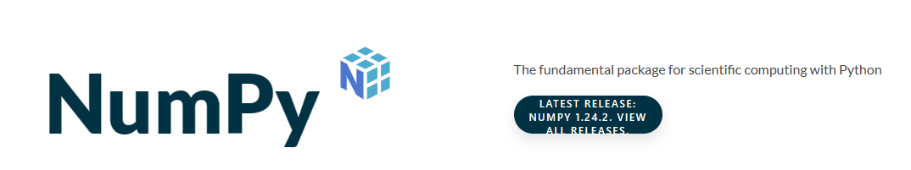

# 理解NumPy

## 简介

官网是[https://numpy.org/](https://numpy.org/)，首页中仅简单的一句介绍

> The fundamental package for scientific computing with Python

以下是官网首页截图



翻译成中文：

> 用Python进行科学计算的基础包

很多Python库都用到了Numpy，比如：scikit-learn, SciPy, pandas 等等。

Numpy最强的地方在于，对`向量（Vectors）`和`矩阵（Matrices）`的**操作**和**计算**，而向量、矩阵是机器学习的基础操作单元。

## 向量、矩阵的操作

操作可以理解为创建、索引、变形等等，它对向量、矩阵的形状进行变换。

### 1 创建
创建向量、矩阵。

```python
import numpy as np

# 创建一个数组
# 可以理解为创建一个向量
np.array([1,2,3])

# 创建一个长度为3的数组，其中的值都为1
# 可以理解为 创建了一个3纬向量，每一个纬度都是1
np.ones(3)
# 当然，类似的还有 值都为0、值随机
np.zeros(3)
np.random.random(3)

# 创建多维数组
# 可以理解为创建矩阵或多阶张量
np.array([[1,2],[3,4]])

# 同理，可以创建每个值都是1、都是0或者随机赋值
np.ones((3,2))
np.zeros((3,2))
np.random.random((3,2))
```

### 2 索引或切片
索引是说，取数组中的某一个值，比如取第一个。而切片，是说，取数组中的部分值。

```python
import numpy as np

# 创建一个数组
vector = np.array([1,2,3])

# 索引，取第一个值
vector[0]

# 切片，取前两个值，注意，0:2这个范围是不包含索引2的
vector[0:2]
# 切片，取后两个值，即索引下标为1和2
vector[1:]

# 多维数组的切片
matrix = np.array([[1,2],[3,4],[5,6]])

# 索引，去第一个值
matrix[0,0]

# 切片，取前两行，范围也不包含后面的2
matrix[0:2]
# 切片，去后两行
matrix[1:3]
# 当然，我们也可以取第一列的前两行
matrix[0:2, 0]
```

### 3 变形
改变数组的形状，我们可以把向量改变成矩阵，也可以将矩阵变为向量，当然，也可以对一个矩阵进行行列转换，这个操作叫`转置`。

```python
import numpy as np

# 创建一个 数组
vector = np.array([1,2,3,4,5,6])

# 将其变换成一个 3*2 的矩阵
matrix = vector.reshape(3,2)
# 再将其变换成一个 2*3的矩阵
matrix = matrix.reshape(2,3)
```

## 向量、矩阵的运算

运算就是我们通常理解的加减乘除，使用Numpy可以对向量、矩阵进行相关的各种计算，比如，向量加向量，向量加矩阵，矩阵乘标量（从小学就开始接触的各种数）等等，其中，最重要的运算是`点积`，在深度机器学习中很常用。

### 1 基础运算
通常理解的加减乘除

```python
import numpy as np

# 创建两个数组
vector1 = np.array([1,2])
vector2 = np.ones(2)

# 相加两个数组
vplus = vector1+vector2
# 想减两个数组
vminus = vector1-vector2
# 相乘
vmulti = vector1*vector1
# 相除
vdiv = vector1/vector1

# 创建两个矩阵
matrix1 = np.array([[1,2], [3,4]])
matrix2 = np.ones((2,2))

# 相加两个矩阵
mplus = matrix1+matrix2
# 相减
mminus = matrix1-matrix2
# 相乘
mmulti = matrix1*matrix1
# 相除
mdiv = matrix1/matrix1
```

### 2 聚合函数
我们可以从向量、矩阵、张量中，获取其中的最大值、最小值、求和值

```python
import numpy as np

# 创建一个 数组
vector = np.array([1,2,3])

# 取最大值
maxv = vector.max()
# 去最小值
minv = vector.min()
# 求和
sumv = vector.sum()

# 创建一个矩阵
matrix = np.array([[1,2], [3,4]])

# 取最大值
matrix.max()
# 取最小值
matrix.min()
# 求和
matrix.sum()

# 对于矩阵，可以按纬度来进行 聚合
# 这里，纵向用0表示，横向用1表示
## 纵向求最大值，结果为 [3,4]
matrix.max(axis=0)
## 横向最大值，结果为 [2,4]
matrix.max(axis=1)
```

### 3 点积
机器学习中，很常用的一个运算，需要我们重点理解。

点积计算**行和列之间** 的 **乘积**之**和**，也叫矩阵乘积。

```text
重点
乘积之和，意思是，行和列要先乘积，再将乘积的结果求和
``` 

```python
import numpy as np

# 创建一个数组
vector = np.array([1,2])
# 创建一个矩阵
matrix = mp.array([[1,10], [100, 1000]])

# 点积，结果为 [201, 2010]
vector.dot(matrix)
```

## 标量、向量、张量
理清这3个量很重要，在机器学习的项目中，会经常用到，我们先看看它们长啥样，对其有个大体映像

|中文名称|英文名称|例子|说明|
|---|---|---|---|
|标量|scalar|1、 2、666、18.8|我们从小学就开始接触到的各种数，比如，买了3斤苹果里的`3`这个数，这个月工资8000块里`8000`，等等|
|向量|vector|(1,3)、(1,3,2)|生活里最常见的就是地理坐标，比如，北京天安门的经纬度坐标是(116.403963,39.915119)，这就是一个向量|
|张量|Tensor|[(1,3),(4,5)]|还是用地理坐标来说，假如我们从北京天安门骑行到国家体育场，这个行驶路径，我们用起点坐标(116.403963,39.915119)和终点坐标(116.403049,39.999352)来表示，可以表示成[(116.403963,39.915119),(116.403049,39.999352)]，这个行驶路径就是一个张量，如果从高德地图上导航，它就是一条线段|

从这个表格中，很容易看出这么个规律：

> 向量 = 标量和标量的组合
>
> 张量 = 向量和向量的组合

那么，如果我们把张量和张量组合起来，比如像这样

> [[(1,3),(4,5)],[(6,7),(8,9)]]

这该叫啥？

答案，还是叫`张量`，当然，不是张亮麻辣烫里的张亮。

那该如何区分这些不同形状的张量？

这里就引入了`阶`的概念。

在Python中，用英文半角中括号`[]`，来表示数组或列表，这里，我们也统一成中括号`[]`，那么，再重新写一次向量、张量，格式如下：

```txt
向量(一阶张量):
[1,3,5]

二阶张量:
[
    [1,3,5],
    [2,4,6]
]

三阶张量:
[
    [
        [1,3,5],
        [2,4,6]
    ],
    [
        [1,3,5],
        [2,4,6]
    ]
]
```
向量是特殊的一阶张量，二阶张量也叫`矩阵`，从书写格式中，能够看出：
1. 多个一阶张量组合，就成了二阶张量
2. 多个二阶张量组合，就成了三阶张量

当然，我们可以一直组合，比如，多个三阶张量组合，就是四阶张量，等等。

如果从中括号的层数来看的话，你会发现，阶数和层数是对应的，一阶有一层中括号，二级有两层，三阶有三层...

## 修改记录
|版次|时间|修改|
|---|---|---|
|v1|2023.04.06|初步记录对Numpy的理解|
|v2|2023.04.09|补充对Numpy的使用、补全对3量的理解说明|

