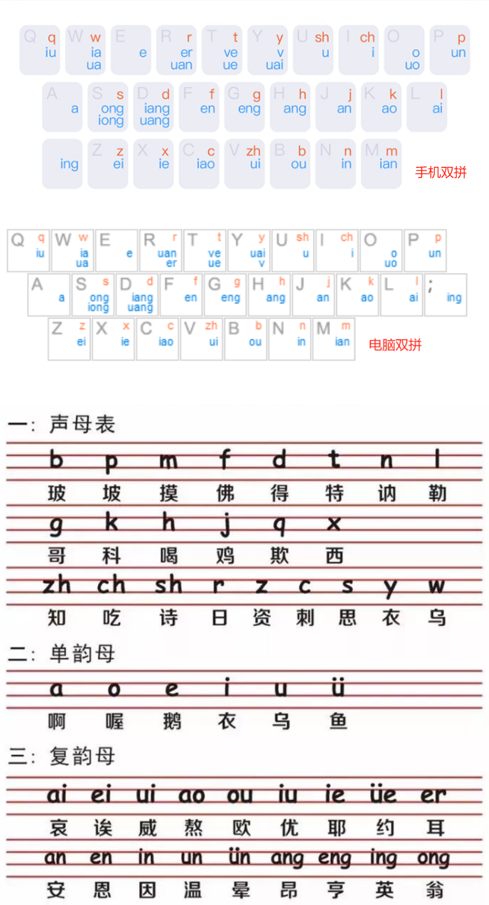

# 搜狗双拼

搜狗双拼输入法，按键对应关系图

## 关系对应
1. 26个英文字母的“发音”
2. 26个英文字母+符号 对应的 “按键”名
3. 键盘按键和“手指”的对应关系
4. 23个声母和 24个韵母 对应的 “按键”名
> 1. 26个英文字母 => 按键 => 手指
> 2. 47个声韵母 => 按键 => 手指
> 3. 中英文的发音字母 => 手指 的 对应关系

需要注意：
1. 图片中**橙色=>声母**，而**蓝色=>韵母(组合)**
2. 韵母**U(鱼)** 对应字母 **V**
3. 一个键上只有1个韵母的是**a、e、;(PC的ing)**，共3个
4. 一个键上有3个声母或韵母的是**w、s、d、r、t、y**，共6个
5. 其余每个键上都有2个声母或韵母